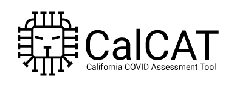
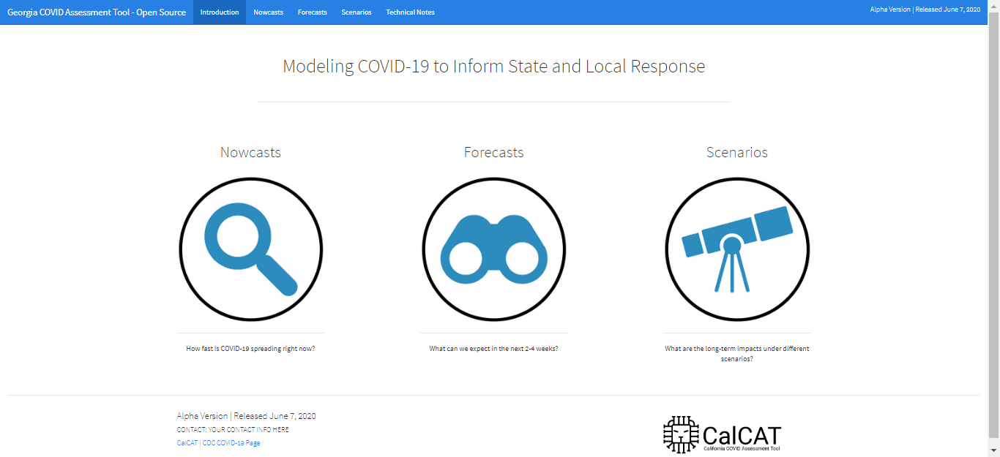

# Introduction 
Welcome to the California COVID Assessment Tool (CalCAT).  This repository contains an application written in Shiny and for use with any US state to assist in assessing the many different models available for understanding COVID-19 transmission and spread. It brings together several data sources that are publicly available, and can be supplemented with your own data to improve the assessment. 

# Getting Started 
_ATTN: This application is designed to run with Rstudio. If you need to download and install Rstudio go [here](https://rstudio.com/) to get started._ 

0. __Fork this Repository__
1. Enter your state's name in line 47 of the `cal_cat_data_routine.rmd` where it says ```state_name <- "California"```
``Ctrl+Alt+R``
This routine will download data for your state from a number of different modeling groups. Yuo can find out more about them in the Technical notes app the application. 
2. You may also modify the data path for the application (line 56), but it defaults to a subdirectory named for your state, for example `data/CA`. 
3. Each data source feeding the CalCAT has one or more functions in the `R` folder which pull the data down when the RMarkdown file is run. You can run this daily to ensure your app has the freshest data. 
4. Once the data routine markdown has completed, you can follow the output messages to see if any sources returned errors. If so, please [submit an issue](https://github.com/StateOfCalifornia/CalCAT/issues) letting us know what problem you ran into. 
5. Next, you can run the app by opening the `global.R` file and again modifying the state name, now on line 40 (for example `state_name <- "Arizona"`).
6. Run and deploy the app. 



# Build and Test
The California version of the app brings together even more publicly available data on cases, deaths, hospitalizations, and bed capacity. Many of these data likely exist in your region. You will need to update these inputs for maximal utility. The app contains some dummy data for these variables (referred to as 'Actuals'), scaled from [the New York Times' repository of daily cases and deaths](https://github.com/nytimes/covid-19-data). 

# Contribute
We can't wait to see what you do with this. Please fork, edit and send us back as [pull requests](https://github.com/StateOfCalifornia/CalCAT/pulls) the changes you'd like to see. Maybe you'll incorporate your own estimator of R-Effective, or add functionality to import data; you could improve on our simple ensemble estimates. Go Wild!

__A gift from California with love.__
_“Together, all things are possible.”_
                -- Cesar Chavez 

### Resources
- [Rstudio](https://rstudio.com/)
- [Shiny](https://shiny.rstudio.com/)
- [covid19.ca.gov](https://covid19.ca.gov/)
